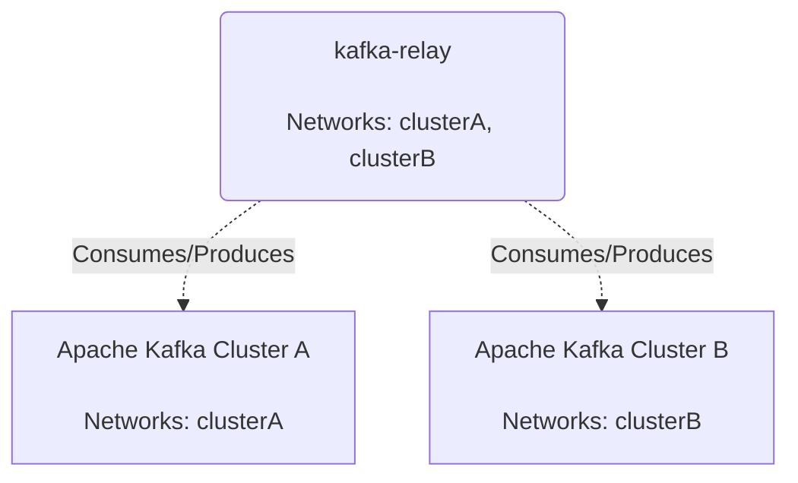
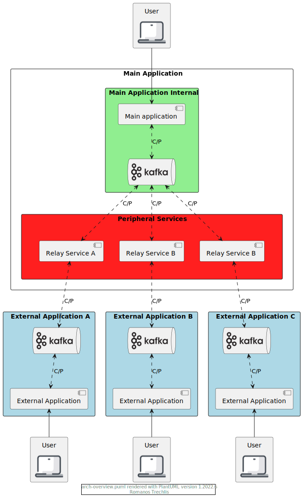
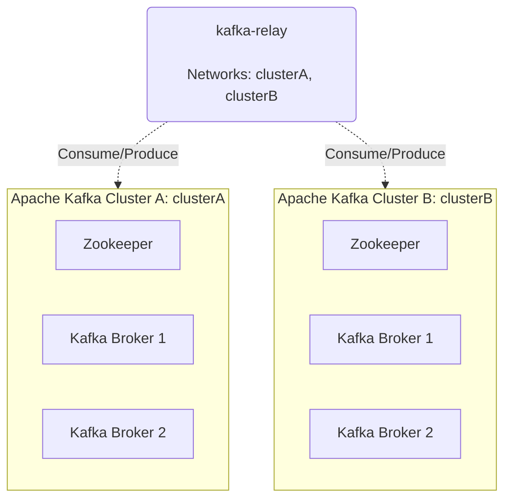

# kafka-relay

**kafka-relay** is a java package that enable reading messages 
from a kafka cluster and forwarding them to another kafka cluster.

As the diagram suggests, the two Kafka clusters are isolated from each other.

The reason for **kafka-relay** existence is that it provides a decoupling between 
the main application and the integrations for third party applications.
That way, the main application knows how to read messages from the kafka cluster A, as well as their format.
The **kafka-relay** is responsible to read integration specific messages from cluster B, transform them in 
the format of the main application and forward them to the cluster A.

In the following diagram we can see that the Main Application (in light green) is seperated from the 
external applications (in light blue) by the relay services (in light red).

## Build

Run the command `gradlew build`.

## Deployment

After building **kafka-relay** we are ready to deploy.

By running `docker-compose up` a demo environment gets deployed.

## Transform

The API exposes an interface `ITransformKafkaMessage` with two methods.

+ String transformToA(String messageFromB);
+ String transformToB(String messageFromA);

The `DefaultKafkaMessageTransformer` returns the message without any actual transformation.

For a specific transformation, implement the `ITransformKafkaMessage` interface.

## Example Usage

Check the example [here](https://github.com/RomanosTrechlis/kafka-relay-example).
