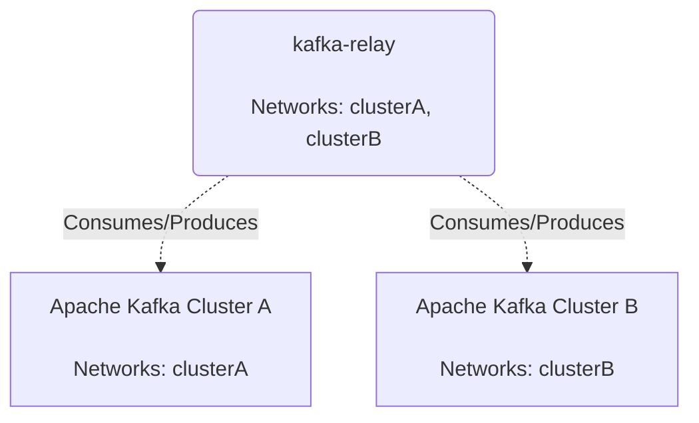
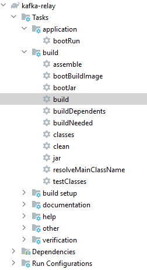
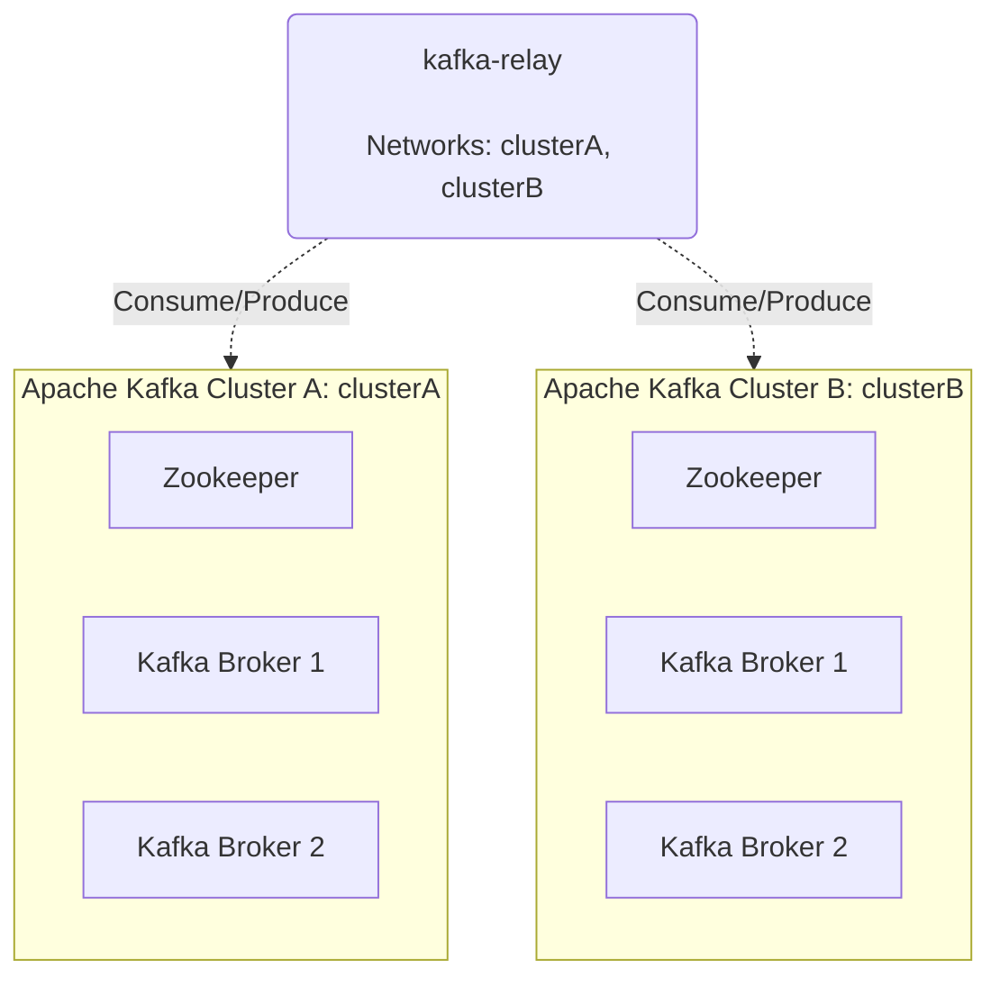
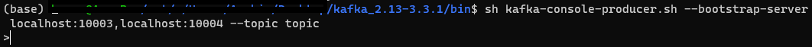
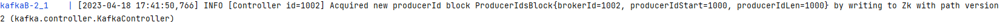
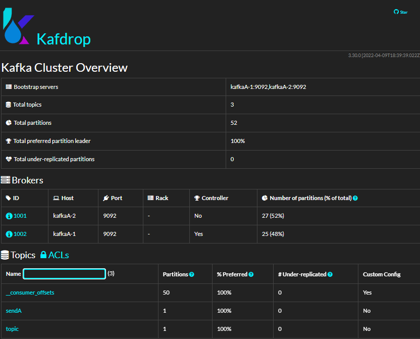
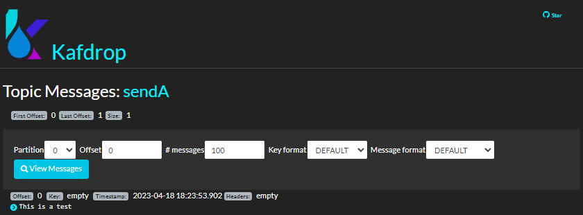
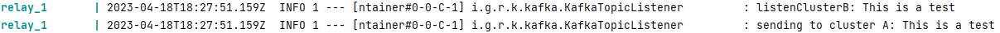

# kafka-relay

**kafka-relay** is a spring-boot application that reads messages 
from a kafka cluster and forwards it to another kafka cluster.



As the diagram suggests, the two Kafka clusters are isolated from each other.

The reason for **kafka-relay** existence is that it provides a decoupling between 
the main application and the integrations for third party applications.
That way, the main application knows how to read messages from the kafka cluster A, as well as their format.
The **kafka-relay** is responsible to read integration specific messages from cluster B, transform them in 
the format of the main application and forward them to the cluster A.

## Build

Build **kafka-relay** using gradle.



Or run the command `gradlew build`.

## Deployment

After building **kafka-relay** we are ready to deploy.

By running `docker-compose up` a demo environment gets deployed.



## Local demo

Run the following command to produce a message to Cluster B.

```
 sh kafka-console-producer.sh --bootstrap-server localhost:10003,localhost:10004 --topic topic
```

This creates a prompt to write the message:



And the following line in the kafka broker appears:



We then write a message to the prompt.

The relay listen to the topic and after transforming the message it sends it to
the other cluster. The new topic is created if it doesn't exist.



Navigating into kafdrop topic we can read the message.



We can also check the relay's logs.



## Configuration

The following properties must be filled in order for the application to run correctly.

```properties
kafka.clusterA.bootstrapAddress=kafka-clusterA
kafka.clusterA.listen.topic=topic
kafka.clusterA.send.topic=sendA
kafka.clusterA.groupId=test
kafka.clusterB.bootstrapAddress=kafka-clusterB
kafka.clusterB.listen.topic=topic
kafka.clusterB.send.topic=sendB
kafka.clusterB.groupId=test
```

Reference also to [docker-compose.yml](docker-compose.yml)

## Transform

The API exposes an interface `ITransformKafkaMessage` with two methods. 

+ String transformToA(String messageFromB);
+ String transformToB(String messageFromA);

The `DefaultKafkaMessageTransformer` returns the message without any actual transformation.

For a specific transformation, implement the `ITransformKafkaMessage` interface.

## Help

[Help.md](docs/HELP.md)

